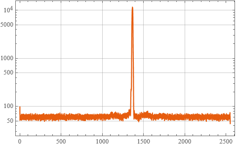

# LabDevicesLink  

Lab devices tools for Wolfrm Language

## Installation

Standard Wolfram Language paclet installation from the Paclet Repository:

```wolfram
Map[PacletSiteUpdate, PacletSites[]]
PacletInstall["KirillBelov/LabDevicesLink"]
```

## Initialization

And standard import:

```wolfram
Get["KirillBelov`LabDevicesLink`"]
```

## FGB Interrogator

What the device? For example this: <https://lenlasers.ru/product/interrogator-gc-97001c/>.  
How to get spectrum from thi device that has address like `192.168.1.XXX`:  

```wolfram
data = FGBInterrogatorData["192.168.1.XXX", "ADCRawData"]
```

>```wolfram
><|"CommandLenght" -> 5112, "ChannelGain" -> 0, "ADCData" -> {100, 55, 58, 55, ..}|>
>```

And how to plot spectrum:  

```wolfram
ListLogPlot[data["ADCData"], 
 Joined -> True, 
 PlotTheme -> "Scientific", 
 GridLines -> Automatic, 
 Frame -> True
]
```

> 
